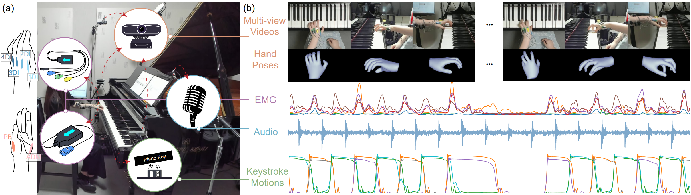
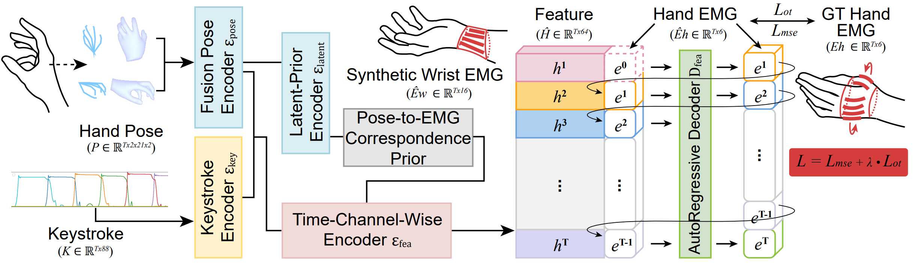
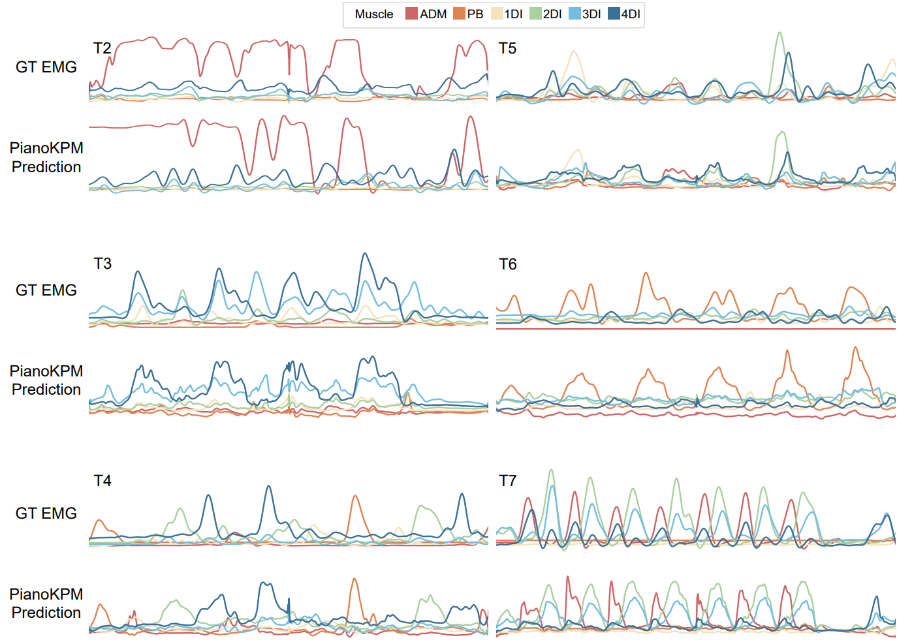

# From Pose to Muscle: Multimodal Learning for Piano Hand Muscle Electromyography
A multimodal dataset, [PianoKPM Dataset](https://drive.google.com/drive/folders/1obGEJMsj-5CXV_0rJWja9Aj7AacTnGzO?usp=sharing), and a hand muscle estimation framework, [PianoKPM Net](https://github.com/ruofanliu0129/PianoKPMNet.git), are introduced to facilitate high-fidelity EMG inference. 

[PianoKPM Dataset](https://drive.google.com/drive/folders/1obGEJMsj-5CXV_0rJWja9Aj7AacTnGzO?usp=sharing):

[PianoKPM Net](https://github.com/ruofanliu0129/PianoKPMNet.git):


Installation setup, dataset downloading, pre-trained models, training, and inference code are provided.

## Installation and Setup

Clone the PianoKPMNet:
```setup
git clone https://github.com/ruofanliu0129/PianoKPMNet.git
cd PianoKPMNet/
```
Create and activate the environment:
```setup
conda env create -f environment.yml
conda activate PianoKPM
```
*Note: We recommended running on a Linux x86_64 (amd64) architecture. The following instructions are tested on an Ubuntu 22.04 Distro.*


## PianoKPM Dataset

Download PianoKPM V1.0 full dataset [HERE](https://drive.google.com/drive/folders/1obGEJMsj-5CXV_0rJWja9Aj7AacTnGzO?usp=sharing).
```dataset
cd /path/to/dataset
unzip hand_data.zip
unzip keystroke_data.zip
unzip emg_data.zip
```

Folder structure:
```dataset
/path/to/dataset
├── hand_data/
│   ├── keyp_top/
│   │   ├── t1_p1_1.pkl
│   │   ├── t1_p1_2.pkl
│   │   ├── ...
│   ├── keyp_right/
│   │   ├── t1_p1_1.pkl
│   │   ├── t1_p1_2.pkl
│   │   ├── ...
├── keystroke_data/
│   ├── t1_p1_1.pkl
│   ├── t1_p1_2.pkl
│   ├── ...
├── emg_data/
│   ├── t1_p1_1.pkl
│   ├── t1_p1_2.pkl
│   ├── ...
├── dataset_architectural.json
├── dataset_held_out.json
```
*Two dataset split configurations are provided:*
- *`dataset_architectural.json`: used in the architectural evaluation (Section 5.1).*
- *`dataset_held_out.json`: used in the held-out evaluation (Section 5.2).*


## Pre-trained Models

Download pretrained models [HERE](https://drive.google.com/file/d/1mV4nQH2cdAY1XD4kpCs2wllLMz9xidgZ/view?usp=sharing).
```pretrained
/path/to/saved_model
├── architectural_eval_model.pth
├── heldout_eval_model.pth
```
*Two pretrained models are provided:*
- *`architectural_eval_model.pth`: used in the architectural evaluation (Section 5.1).*
- *`heldout_eval_model.pth`: used in the held-out evaluation (Section 5.2).*


## Configuration Update

Edit `PianoKPMNet/config/base.yaml`:
1. Set `data_root` to your dataset path.
2. Update `dataset_split` to your dataset split configuration file path.
5. (Optional) Adjust training hyperparameters like `train.epoch`, `train.batch_size`, `train.lr` etc.
4. (Optional) Update `checkpoint_path` and `checkpoint_name` to specify the pre-trained model.
4. (Optional) Choose `inference.test_set` to evaluate different test sets (e.g., "test", "test_cross_user", "test_cross_task").

## Training

To train the PianoKPM Net in the paper, run this command:
```train
python train.py
```
This will create a `ckpt` folder with the following structure:
```
/path/to/ckpt/yyyy-mm-dd/HH-MM-SS
├── pianokpm.log
├── model/ 
│   ├── saved best models
├── train_plots/ 
│   ├── E0020/
│   │   ├── plots in training set at epoch 20
│   ├── E0040/
│   ├── ...
├── eval_plots/ 
│   ├── E0020/
│   │   ├── plots in validation set at epoch 40
│   ├── E0040/
│   ├── ...
```


## Evaluation

To evaluate a model on PianoKPM Net, run:

```eval
python inference.py
```
This will create a `ckpt` folder with the following structure:
```
/path/to/ckpt/yyyy-mm-dd/HH-MM-SS
├── pianokpm.log
├── inference_emg/ 
│   ├──  estimated EMG sequences
├── inference_plots/ 
│   ├── visualization results for keystroke motions, GT EMG, and estimated EMG
```


## Results

Our model achieves the following performance on PianoKPM Dataset:

| Evaluation | Model name         | Test set | RMSE  | OTD |
| ------------------| ------------------ |---------------- |---------------- | -------------- |
| Architectural evaluation | architectural_eval_model.pth   |  test  |   0.134         |      0.031       |
| Held-out evaluation | heldout_eval_model.pth   |    test_cross_user | 0.209         |      0.095       |
| Held-out evaluation | heldout_eval_model.pth   |    test_cross_task | 0.264         |      0.152       |


